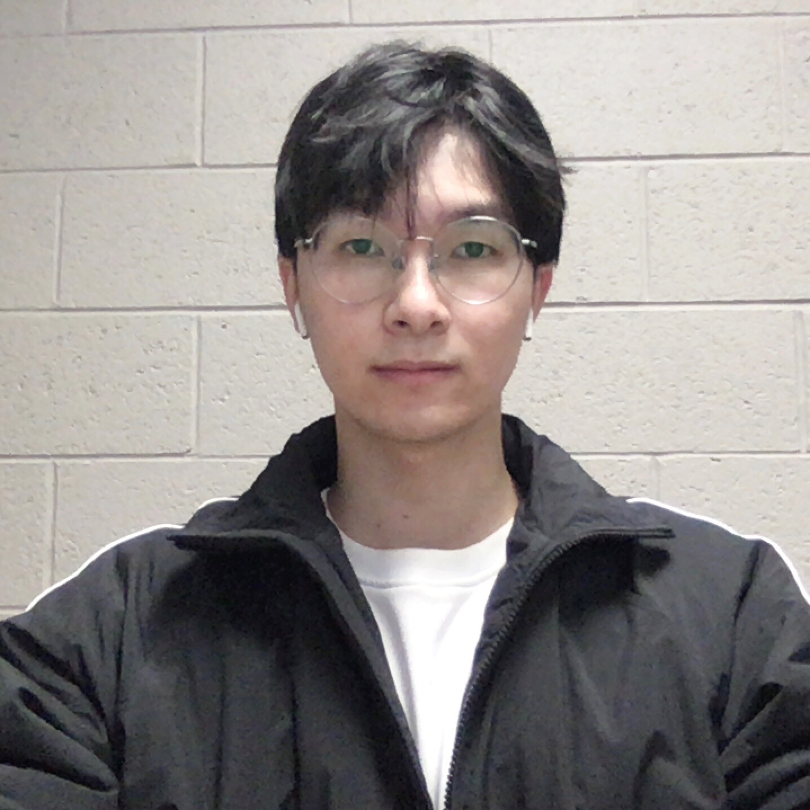

# SDM2023 tutorial: Augmentation Methods for Graph Learning

## Time and Location

10:15-12:15 am, April 27, 2023

Graduate Minneapolis Hotel | Minneapolis, Minnesota, U.S.

(Detailed time and room will be updated soon.)

## Tutorial Abstract

Data augmentation (DA) has recently seen increased interest in graph mining and graph machine learning (ML) owing to its ability to create additional training data and improving resulting trained model generalization. Despite these developments, the area is still quite underexplored, due to the challenges brought by complex, non-Euclidean structure of graph data, which limits the direct analogizing of traditional label-preserving augmentation operations in e.g. computer vision or natural language to this domain. In this tutorial, we present a comprehensive, systematic and structured survey of graph DA (GDA) approaches.  We first overview necessary background in graph machine learning, graph neural networks (GNNs), and DA.  Next, we present a breadth of literature, separated by heuristic augmentation approaches, learned augmentation approaches, and conclude. We anticipate this tutorial will be valuable for researchers in the graph ML domain, as well as practitioners utilizing these techniques for a wide variety of low-resource applications lacking significant labeled data.

#### Tutorial Proposal: [\[PDF\]](assets/SDM23_Tutorial_Graph_Data_Augmentation.pdf)

<!--
#### If you find this tutorial helpful for your work, please kindly cite our paper.

```bibtex
@inproceedings{zhao2023augmentation,
  todo
}
```
-->

## Materials

**Survey:**

- Graph Data Augmentation for Graph Machine Learning: A Survey. [\[PDF\]](https://arxiv.org/pdf/2202.08871.pdf) [\[Reading list\]](https://github.com/zhao-tong/graph-data-augmentation-papers)

- Data Augmentation for Deep Graph Learning: A Survey. [\[pdf\]](https://arxiv.org/pdf/2202.08235.pdf)

**Tutorial schedule (tentative):**

| Local time (CST) | Content | Presenter |
| :---: | :---: | :---: |
| 10:15-10:45 | TBD | Tong Zhao |
| 10:45-11:10 | TBD | Kaize Ding |
| 11:20-11:45 | TBD | Wei Jin |
| 11:45-12:15 | TBD | Neil Shah |

## Presenters and Contributors

## &nbsp;  &nbsp;  &nbsp;   &nbsp;  &nbsp;  &nbsp; 

&nbsp; &nbsp; &nbsp; &nbsp; Tong Zhao &nbsp; &nbsp; &nbsp; &nbsp; &nbsp; &nbsp; &nbsp; Kaize Ding &nbsp; &nbsp; &nbsp; &nbsp; &nbsp; &nbsp; &nbsp; &nbsp; Wei Jin &nbsp; &nbsp; &nbsp; &nbsp; &nbsp; &nbsp; &nbsp; &nbsp; &nbsp; Gang Liu &nbsp; &nbsp; &nbsp; &nbsp; &nbsp; &nbsp; &nbsp; Meng Jiang &nbsp; &nbsp; &nbsp; &nbsp; &nbsp; &nbsp; &nbsp; Neil Shah

**[Tong Zhao](https://tzhao.io/)** is a Research Scientist in the Computational Social Science group at Snap Research. His research focuses on graph machine learning, representation learning, and data augmentation methods on graphs. His work has resulted in 20+ conference and journal publications, in top venues such as ICML, KDD, AAAI, WWW, TNNLS, etc. Several of his works were pioneer studies of GDA.

**[Kaize Ding](https://www.public.asu.edu/~kding9/)** is currently a Ph.D. candidate at Arizona State University. His research interests are broadly in data mining and machine learning, with a particular focus on graph neural networks, and data-efficient learning. He has published over 30 papers on top conferences and journals such as WWW, WSDM, EMNLP, AAAI, and TNNLS. He is also the leading author of a GDA paper.

**[Wei Jin](http://cse.msu.edu/~jinwei2/)** is a Ph.D. student of Computer Science and Engineering at Michigan State University. He works in the area of graph learning and data-centric AI. He has published his research in top conference proceedings (e.g., ICLR, KDD, ICML, WSDM and AAAI).  He has also served as (senior) program committee member at a number of these.

**[Gang Liu](https://liugangcode.github.io/)** is a second-year Ph.D. student of Computer Science and Engineering at the University of Notre Dame. His research interests include graph machine learning and data augmentation. He has publications in top venues such as ICML and KDD.

**[Meng Jiang](http://www.meng-jiang.com/)** is an assistant professor at the Department of Computer Science and Engineering in the University of Notre Dame. His research interests include data mining, machine learning, and natural language processing. The awards he received include best paper finalist in KDD 2014, the best paper award in KDD-DLG workshop 2020, and ACM SIGSOFT Distinguished Paper Award in ICSE 2021. He received Notre Dame Faculty Research Award in 2019, NSF CRII Award in 2019, NSF III Grant (Comprehensive Methods to Learn to Augment Graph Data) in 2022, and NSF CAREER award in 2022.

**[Neil Shah](https://nshah.net/)** is a Lead Research Scientist and Manager at Snap Research, working on machine learning algorithms and applications on large-scale graph data. His work has resulted in 50+ conference and journal publications, in top venues such as ICLR, NeurIPS, KDD, WSDM, WWW, AAAI and more, including several best-paper awards. He has also served as an organizer, chair and senior program committee member at a number of these. He is the corresponding author of a key early pioneering work in GDA and several further GDA studies.
